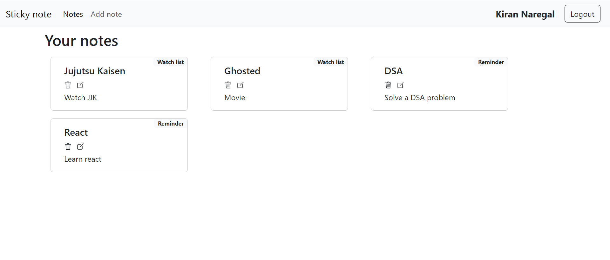

# Sticky notes

Sticky Notes is a versatile and user-friendly application designed to streamline your note-taking experience.


## Features

- Interactive web user interface
- Provides user authentication using JWT
- Stores user data in MongoDB


## Installation

Run `npm i` command in base, frontend and server directories

```
npm i
cd frontend
npm i
cd ../server
npm i
```
## Environment Variables

To run the project create .env file in the both frontend and server directories. Edit env files  according to the sample file.

## Run Locally

Run `npm run dev` script in base directory

```
npm run dev
```

Starts the complete project in the development mode.\
Open [http://localhost:3000](http://localhost:3000) to view it in your browser.

## Screenshots



